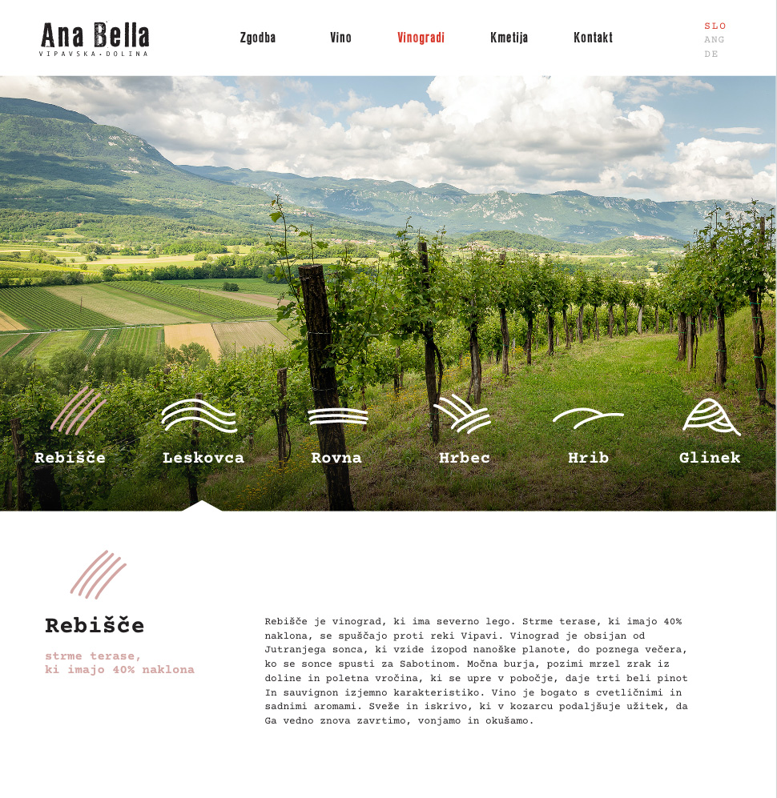

# Frontend Recruitment Task

Hi!

Thank you for joining our recruitment process @ Artnetik! This task will test how you can work with front-end project.

## Task

We have to create a Vue component for our clients. Can you ship it?

The design can be found in sources library in Adobe XD format.
We work mostly with Adobe XD and Affinity Designer. Both have a free trial license, so you can use either for this task

## Requirements

Users should be able to switch between wine yards by clicking the icon with text on the photo.

## Rules & Hints

1. Use Nuxt.js for a kickstart
2. Try to use no CSS framework for the layout. If that's too challenging for you, you can use Bootstrap or Foundation to help you out.
3. Styles should be written in Sass (SCSS).
4. Pay attention to code quality, formatting, conventions etc. (Your code is your business card)
5. Send us the link to the site and access to your GitHub repo to check out your work!
7. BONUS: Try to use Github Actions to generate and deploy static page on Github pages, when ever user pushes or merge new code to a master branch.
